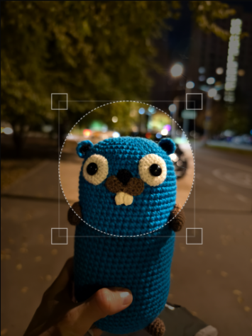

# canvas-image-resize

Changes the canvas size

## Installation

```bash
npm install canvas-image-resize
```

## Usage

1. Imports `canvas-image-resize`.

For ES Modules:

```ts
import { resize } from "canvas-image-resize";
```

For CommonJS:

```ts
const { resize } = require("canvas-image-resize");
```

2. Example of use.

```ts
resize({ canvas, options: { width: 640 } });
```
or
```ts
const { resizedCanvas } = resize({ canvas, options: { width: 640 } });
```

## API

resize({ canvas, options })

Canvas

- canvas : HTMLCanvasElement - An html5 canvas element to resize and draw from

Options

- height : number - New height of the canvas ex: 300
- width : number - New width of the canvas ex: 400
- keepAspectRatio : boolean - Flag to maintain proportions. Default: true
- imageSmoothingQuality : "low" | "medium" | "high" - Image smoothing quality. Default: "high"
- contextType : "2d" - Canvas context type. Default: "2d"

Return object
- resizedCanvas : HTMLCanvasElement

### Canvas image before resizing (width="500" height="500")



### Canvas image after resizing (width="250" height="250")


## License

MIT
